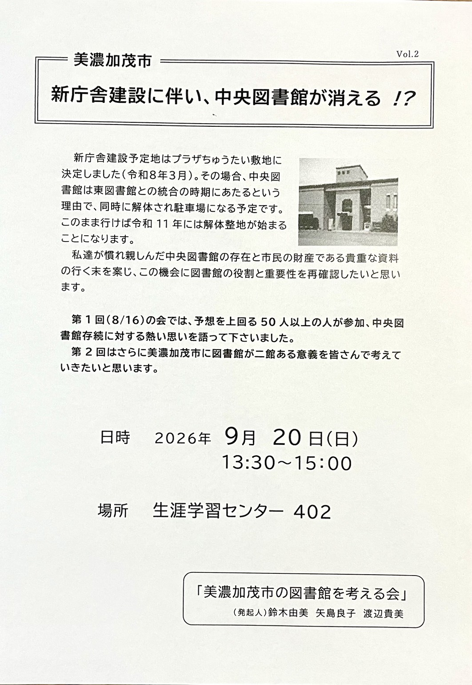
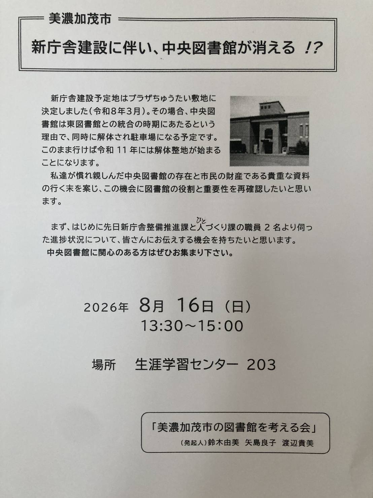

**更新日付: 2026年9月20日**

* TOC
{:toc}

# 活動記録

- 2026-09-20(日）13:30 ～ 15:30 生涯学習センター402室　集い（第2回）

  
- 2026-08-16(日）13:00 ～ 15:00 生涯学習センター203室　集い（第1回）

# 関係資料

## 図書館関係法令等

1. <a href = "https://laws.e-gov.go.jp/law/325AC0000000118/" target="_blank">図書館法（昭和二十五年法律第百十八号）</a>
1. <a href = "https://laws.e-gov.go.jp/law/325M50000080027/" target="_blank"> 図書館法施行規則（昭和二十五年文部省令第二十七号）</a>
1. <a href = "https://www.mext.go.jp/a_menu/01_l/08052911/1282451.htm" target="_blank">図書館の設置及び運営上の望ましい基準（平成24年12月19日文部科学省告示第172号）</a>

---

1. <a href = "https://www1.g-reiki.net/minokamo/reiki_honbun/i312RG00000367.html" target="_blank">美濃加茂市立図書館設置条例　昭和54年3月24日　条例第7号</a>
1. <a href = "https://www1.g-reiki.net/minokamo/reiki_honbun/i312RG00001002.html" target="_blank">美濃加茂市立図書館設置条例施行規則 平成25年9月1日 規則第40号</a>
1. <a href = "https://www1.g-reiki.net/minokamo/reiki_honbun/i312RG00000369.html" target="_blank">美濃加茂市立図書館協議会規則 平成21年3月31日 規則第25号</a>

## 美濃加茂市立図書館ホームページ

1. <a href = "https://www.city.minokamo.lg.jp/site/library/" target="_blank">美濃加茂市立図書館HP</a>
1. <a href = "https://www.city.minokamo.lg.jp/site/library/21513.html" target="_balnk">【共通】［重要］図書館ホームページＵＲＬ変更のお知らせ 2026年3月18日更新</a>
1. <a href ="https://www3.city.minokamo.gifu.jp/" target="_blank">美濃加茂市立図書館HP 2026-03-31終了</a>

## 図書館協議会

### 図書館協議会 会議内容

1. 令和８年度第1回　令和8年6月23日（火）午前９時30分〜11時　中央図書館2階集会室
   1. 図書館の運営方針について
   2. 図書館の概要について（施設・各種指標）
   3. 令和7年度利用状況について
   4. 令和8年度行事計画について
   5. 図書館ビジョンについて
   6. その他

2. 令和８年度第2回　令和8年9月30日（水）午前10時〜正午　中央図書館2階集会室（予定）
   1. 美濃加茂市公共施設等類型別カルテの図書館に係わる基本方針について
   2. 美濃加茂市図書館ビジョン（案）に係わる委員からの意見について
   3. 図書館協議会の傍聴の取り扱いについて
   4. その他

 
### 図書館協議会議事録

1. <a href = "https://www.city.minokamo.lg.jp/uploaded/attachment/20139.pdf" target="_blank">2026-02-18 令和７年度第２回図書館協議会議事録</a>

### 図書館協議会委員
1. <a href = "./toshokan_kyogikai_member.html" target= "_blank"> 図書館協議会 委員名簿</a>

### 参考資料

1. これからの図書館協議会を考える : 公共図書館と市民が向き合うために 河瀬 裕子 図書館界 = The library world 76 (4), 234-239, 2024-11 <a href = " https://doi.org/10.20628/toshokankai.76.4_234" target="_blank"> DOI</a>

## 図書館年報等

1. <a href = "https://www3.city.minokamo.gifu.jp/release/fileopen.cfm?id=388" target="_blank">図書館年報　令和7年度（令和6年度資料）</a>
1. <a href = "https://www3.city.minokamo.gifu.jp/release/fileopen.cfm?id=366" target="_blank">図書館年報　令和6年度（令和5年度資料）</a>
1. <a href = "https://www3.city.minokamo.gifu.jp/release/fileopen.cfm?id=353" target="_blank">図書館年報　令和5年度（令和4年度資料）</a>
1. <a href = "https://www3.city.minokamo.gifu.jp/release/fileopen.cfm?id=325" target="_blank">図書館年報　令和4年度（令和3年度資料）</a>
1. <a href = "https://www3.city.minokamo.gifu.jp/release/fileopen.cfm?id=326" target="_blank">図書館年報　令和3年度（令和2年度資料）</a>
1. 図書館年報　令和2年度（令和元年度資料）　URL不明
1. <a href = "https://www3.city.minokamo.gifu.jp/release/fileopen.cfm?id=271" target="_blank">図書館年報　令和元年度（平成30年度資料）</a>
1. <a href = "https://www3.city.minokamo.gifu.jp/release/fileopen.cfm?id=249" target="_blank">図書館年報　平成30年度（平成29年度資料）</a>
1. <a href = "https://www3.city.minokamo.gifu.jp/release/fileopen.cfm?id=205" target="_blank">図書館年報　平成29年度（平成28年度資料）</a>
1. <a href = "https://www.city.minokamo.lg.jp/uploaded/attachment/19690.pdf" target="_blank">図書館年報　平成28年度（平成27年度資料）</a>
1. <a href = "https://www3.city.minokamo.gifu.jp/release/fileopen.cfm?id=107" target="_blank">図書館年報　平成27年度（平成26年度資料）</a>
1. <a href = "https://www3.city.minokamo.gifu.jp/release/fileopen.cfm?id=75" target="_blank">図書館年報　平成26年度（平成25年度資料）</a>
1. <a href = "https://www3.city.minokamo.gifu.jp/release/fileopen.cfm?id=41" target="_blank">図書館年報　平成25年度（平成24年度資料）</a>
1. <a href = "https://www.city.minokamo.lg.jp/uploaded/attachment/19694.pdf" target="_blank">図書館年報　平成24年度（平成23年度資料）</a>
1. <a href = "https://www3.city.minokamo.gifu.jp/release/fileopen.cfm?id=13" target="_blank">図書館年報　平成23年度（平成22年度資料）</a>
1. <a href = "https://www3.city.minokamo.gifu.jp/release/fileopen.cfm?id=6" target="_blank">図書館年報　平成22年度（平成21年度資料）</a>

## 図書館関係予算

美濃加茂市歳入歳出決算書

1. <a href = "https://www.city.minokamo.lg.jp/uploaded/attachment/15501.pdf#page=94" target="_blank">美濃加茂市一般会計　歳入歳出決算事項別明細書（歳出）令和５年度 94p</a>
2.  <a href = "https://www.city.minokamo.lg.jp/soshiki/30/2633.html" target="_blank">美濃加茂市歳入歳出決算書（令和5年度決算書〜令和4年度決算書）</a>

決算実績報告書

1. <a href = "https://www.city.minokamo.lg.jp/soshiki/28/2572.html" target="_blank">決算実績報告書（令和７年度実績報告書〜平成22年度決算実績報告書)</a>
3. <a href = "./003.html" target="_blank" > 施設管理事業決算額の推移（令和元年から令和６年度まで）</a>

           
## 計画等

1. <a href ="https://www3.city.minokamo.gifu.jp/release/fileopen.cfm?id=1&filename=/katudousuisin.pdf" target="_blank">美濃加茂市子どもの読書活動推進計画（平成18年3月）</a>　
1. <a href = "https://www.pref.gifu.lg.jp/page/171510.html" target="_blank"> 市町村子どもの読書活動推進計画の策定状況（確認日:令和8年3月9日）<a/>

---

1. <a href = "https://www.city.minokamo.lg.jp/uploaded/life/15706_26038_misc.pdf" target="_blank">美濃加茂市教育振興基本計画　令和７年度-令和１１年度　令和７年３月策定</a>
1. <a href = "https://static.gifu-ebooks.jp/actibook_data/01_minokamo_city_6th_comprehensive_plan_late_basic_plan__/?pNo=48" target="_blank">美濃加茂市第6次総合計画後期基本計画　政策6　生涯学習・文化スポーツ　令和７年4月1日</a>

---

1. <a href = "https://www.city.minokamo.lg.jp/soshiki/26/6788.html" target="_blank">美濃加茂市　事業評価　令和6年度〜令和4年度</a>
1. <a href = "https://www.city.minokamo.lg.jp/uploaded/attachment/18717.pdf" target="_blank"> 令和６年度事業評価書　市民協働部 ひとづくり課  実施計画事業</a>

## 美濃加茂市公共施設等総合管理計画

1. <a href ="https://www.city.minokamo.lg.jp/soshiki/27/2562.html" target="_blank">「美濃加茂市公共施設等総合管理計画」について</a>
1. <a href ="https://www.city.minokamo.lg.jp/uploaded/attachment/6761.pdf" target="_blank">美濃加茂市公共施設等総合管理計画　本編＋資料編1・2（平成29年3月　平成31年1月一部改定　令和4年3月一部改訂）</a>
1. <a href = "https://www.city.minokamo.lg.jp/uploaded/attachment/19601.pdf#page=48" target="_blank" >R7公共施設等類型別カルテ（公共施設白書）令和8年2月</a><a href = "./001.html" target="_blank" > 抜粋あり</a> 

---

1. <a href = "https://www.city.kakamigahara.lg.jp/_res/projects/default_project/_page_/001/010/615/r8.4_2-1.pdf" target="_blank" >各務原市社会教育系施設（中央図書館、もりの本やさん・森の交流館）個別施設計画</a>令和３年3月（令和８年4月一部改訂）

   
1. <a href = "https://current.ndl.go.jp/ca2034" _target="_blank">カレントアウェアネス No.354　2022年12月20日 CA2034
動向レビュー 公共施設等総合管理計画と公立図書館の施設整備 慶應義塾大学文学部：松本直樹</a>

1. 建築物の耐久計画の考え方 (耐久性に関する話題を中心に) 白山 和久 <a href = "https://doi.org/10.14820/finexjournal.2.2_59" target="_blank">DOI</a>

1. <a href = "https://www.aij.or.jp/jpn/archives/971202.htm" target="_blank">気候温暖化への建築分野での対応（会長声明全文）1997年12月2日  社団法人 日本建築学会</a>

## 新庁舎整備関係

1. <a href ="https://www.city.minokamo.lg.jp/soshiki/24/21451.html" target="_blnak">美濃加茂市新庁舎整備基本構想</a>
1. <a href = "https://minokamochosha.jp/wp-content/uploads/2026/03/%E3%80%90%E5%8F%82%E8%80%83%E8%B3%87%E6%96%99%E3%80%9101-1%E5%9F%BA%E6%9C%AC%E6%A7%8B%E6%83%B3%EF%BC%88%E6%9C%AC%E7%B7%A8%EF%BC%89.pdf" target="_blank">新庁舎整備基本構想　本編</a>
1. <a href = "https://minokamochosha.jp/wp-content/uploads/2026/03/%E3%80%90%E5%8F%82%E8%80%83%E8%B3%87%E6%96%99%E3%80%9101-2%E5%9F%BA%E6%9C%AC%E6%A7%8B%E6%83%B3%EF%BC%88%E6%A6%82%E8%A6%81%E7%89%88%EF%BC%89.pdf" target="_blank">新庁舎整備基本構想　概要版 = みんなの新庁舎かわらばんvol.7 </a>

---
1. <a href ="https://www.city.minokamo.lg.jp/soshiki/24/" target="_blank">新庁舎整備推進課</a>

1. <a href ="https://minokamochosha.jp/wp-content/uploads/2026/03/%E3%80%90%E5%8F%82%E8%80%83%E8%B3%87%E6%96%99%E3%80%9101-2%E5%9F%BA%E6%9C%AC%E6%A7%8B%E6%83%B3%EF%BC%88%E6%A6%82%E8%A6%81%E7%89%88%EF%BC%89.pdf" target="_balnk">みんなの新庁舎かわらばんvol.7</a>

1. <a href ="https://minokamochosha.jp/wp-content/uploads/2025/06/%E3%80%90070610%E6%9C%80%E7%B5%82%E3%80%91%E3%81%8B%E3%82%8F%E3%82%89%E3%81%B0%E3%82%93vol.6.pdf" target="_balnk">みんなの新庁舎かわらばんvol.6</a>
 <a href = "./004.html" target="_blank" > 抜粋あり</a>
 1. <a href="https://minokamochosha.jp/wp-content/uploads/2025/01/%E3%80%90%E6%9C%80%E7%B5%82%E3%80%91%E3%81%8B%E3%82%8F%E3%82%89%E3%81%B0%E3%82%93.pdf" target="_blank">みんなの新庁舎かわらばんvol.5</a>
<a href = "./005.html" target="_blank" > 抜粋あり</a>
1. <a href ="https://www.city.minokamo.lg.jp/uploaded/attachment/17073.pdf" target="_blank">みんなの新庁舎かわらばんvol.4</a>
1. <a href ="https://www.city.minokamo.lg.jp/uploaded/attachment/17072.pdf" target="_blank">みんなの新庁舎かわらばんvol.3</a>
1. <a href ="https://www.city.minokamo.lg.jp/uploaded/attachment/17071.pdf" target="_blank">みんなの新庁舎かわらばんvol.2</a>
1. <a href = "https://www.city.minokamo.lg.jp/uploaded/attachment/11932.pdf" target="_blank">みんなの新庁舎 かわらばんvol.1 2024年2月23日更新</a>
1. <a href ="https://www.city.minokamo.lg.jp/uploaded/attachment/18539.pdf" target="_blank">新庁舎整備事業説明会説明会の質問に対する回答（2025.9.21開催：みのかも文化の森）</a>
<a href = "./006.html" target="_blank" > 抜粋あり<a>
1. <a href ="https://www.city.minokamo.lg.jp/uploaded/attachment/20837.pdf" target="_blank"> 「美濃加茂市新庁舎整備基本構想（案）」に関する意見募集結果</a>　この情報は <a href = "https://www.city.minokamo.lg.jp/soshiki/26/2531.html" target="_blank"> パブリックコメント</a>に掲載あり。
<a href = "./007.html" target="_blank" > 抜粋あり<a>

## 議会等

1. <a href = "https://www.city.minokamo.lg.jp/site/gikai/" target="_blank">美濃加茂市議会</a>
1. <a href = "https://smart.discussvision.net/smart/tenant/minokamo/WebView/rd/council_1.html" target="_blank">美濃加茂市議会　議会中継</a>

<!-- 
  - <a href ="https://smart.discussvision.net/smart/tenant/minokamo/WebView/rd/speech.html?council_id=59&schedule_id=3&playlist_id=6&speaker_id=14&target_year=2026" target="_blankl">2026-09-04　一般質問　森弓子議員</a>
-->

1. <a href = "https://www.city.minokamo.lg.jp/site/gikai/7808.html" target="_blank">傍聴について</a>
1. <a href = "https://www.city.minokamo.lg.jp/site/gikai/7853.html" target="_blank">請願・陳情・意見書</a>

---
1. <a href = "https://www.city.minokamo.lg.jp/soshiki/36/23142.html" target="_blank">令和8年度美濃加茂市教育委員会会議録</a>
1. <a href = "https://www.city.minokamo.lg.jp/soshiki/36/17947.html" target="_blank">令和7年度美濃加茂市総合教育会議会議録</a>
  
## 美濃加茂市に係る図書館指標

1. <a href = "./data/stat1.html" target="_blank" >美濃加茂市立図書館　2003-2020</a>
1. <a href = "./data/stat2.html" target="_blank" >県内市立図書館　2020年調査</a>
1. <a href = "./data/stat3.html" target="_blank" >県内図書館竣工年　2020年調査</a>

## misc（その他）

### 医学・医療情報

1. <a href = "https://www3.city.minokamo.gifu.jp/news_view.cfm?news_id=1190" target = "_blank">医中誌Webが利用できるようになりました(美濃加茂市立図書館)掲載期間 2023/06/27 ～ 2023/12/31</a>

---

1. <a href = "https://www.jamas.or.jp/public/publiclibrary.html" target = "_blank">医中誌Webを使える公共図書館</a>
1. <a href = "https://www.jamas.or.jp/public/" target = "_blank">医療情報を探したい方へ</a>
1. <a href = "https://help.jamas.or.jp/houjin/pubmedAbout.html" target="_blank">医中誌WebのPubMed検索</a>
1. <a href = "https://www.library.pref.gifu.lg.jp/user-guide/not-visit/copy-mail/" target="_blank">郵送による複写（岐阜県図書館）</a>
1. <a href = "https://www.ndl.go.jp/copy/remote" target="_blank">遠隔複写サービス(国立国会図書館）</a>

### 文部科学省

1. <a href = "https://www.mext.go.jp/b_menu/houdou/mext_01613.html" target="_blank">文部科学省　図書館が拓く未来の学びと地域社会（報告書）令和8年3月17日　図書館・学校図書館の運営の充実に関する有識者会議</a>
1. <a href = "https://www.mext.go.jp/a_menu/shougai/tosho/mext_00001.html" target="_blank">文部科学省　図書館・書店等連携実践事例集　令和6年6月　文部科学省総合教育政策局地域学習推進課</a>

### 国立国会図書館

1. <a href ="https://dl.ndl.go.jp/" target="_blank">国立国会図書館デジタルコレクション</a>
1. <a href = "https://www.ndl.go.jp/use/digital_transmission" target="_blank"> 図書館向けデジタル化資料送信サービス</a>
1. <a href = "https://www.ndl.go.jp/use/digital_transmission_individuals" target="_blank">個人向けデジタル化資料送信サービス</a>
1. <a href = "https://www.ndl.go.jp/library/supportvisual/send" target="_blank">視覚障害者等用データ送信サービス<a/>

### 日本図書館協会

1. <a href = "https://www.jla.or.jp/library_resources-_and_guidelines/missions_and_goals/" target="_blank">公立図書館の任務と目標　1989年1月　確定公表　2004年3月　改訂　日本図書館協会図書館政策特別委員会</a>

### IFLA(International Federation of Library Associations and Institutions)
1. <a href = "https://repository.ifla.org/rest/api/core/bitstreams/d83848e9-0637-4ab6-a868-443ed044da3f/content" target="_blank">IFLA-UNESCO 公共図書館宣言 2022 2022 年 7 月 18 日採択</a>
1. <a href = "https://current.ndl.go.jp/ca2056" target="_blank">CA2056 – 「ユネスコ公共図書館宣言2022」：2022年版に至る歩みとその活用 / 永田治樹</a>

### 図書館問題研究会

1. <a href ="https://tomonken.org/wp-content/uploads/2026/07/%E5%9B%B3%E6%9B%B8%E9%A4%A8%E8%A8%88%E7%94%BB%E3%81%AF%E3%81%93%E3%82%8C%E3%81%A7%E3%81%84%E3%81%84%E3%81%AE%E3%81%8B%EF%BC%9F-%E3%83%AA%E3%83%BC%E3%83%95%E3%83%AC%E3%83%83%E3%83%88%E6%94%B9%E8%A8%82%E7%89%88-2026.7.6.pdf" target="_blank">図書館問題研究会　図書館計画はこれでいいのか？　リーフレット図書館問題研究会図書館づくり支援委員会　改訂版 2026 年 7 月発行改訂版</a>

## 資料室URLのQRコード

## 閲覧者数(2026-09-20から）

